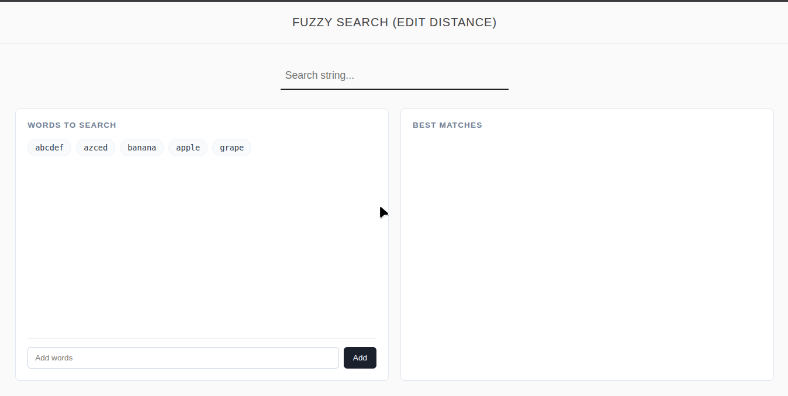

# 🔍 Fuzzy Search (Edit Distance)

A simple fuzzy searching project built using **HTML, CSS, and Vanilla JavaScript**.

This project demonstrates how the **Edit Distance (Levenshtein Distance)** algorithm can be used to find similar words in real time.

---

## 🎥 Demo



---

## ✨ Features

- Real-time fuzzy search
- Dynamic word addition
- Edit distance matching
- Simple UI
- Pure JavaScript implementation
- No frameworks or libraries used

---

## 🧠 How It Works

The application compares the search query against stored words using the **Levenshtein Distance** algorithm.

Smaller distance = more similar word.

### Example

| Word 1 | Word 2 | Distance |
|--------|--------|----------|
| apple  | aple   | 1 |
| banana | banan  | 1 |
| abcdef | azced  | 3 |


---

## 🚀 Getting Started

### Clone the repository

```bash
git clone https://github.com/yourusername/fuzzy-search.git
```

### Open the project

Simply open:

```txt
index.html
```

in your browser.

---

## 🛠 Technologies Used

- HTML
- CSS
- JavaScript

---

## 🔮 Future Improvements

- Display actual edit distance values
- Highlight matching characters
- Better ranking system
- Keyboard navigation
- LocalStorage support

---

